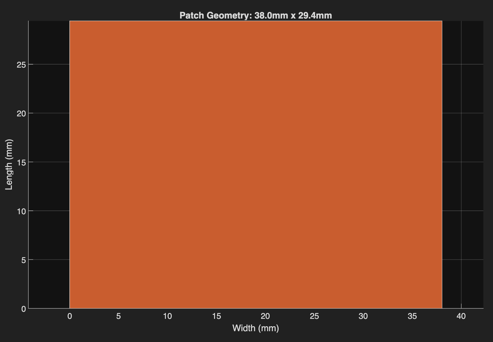
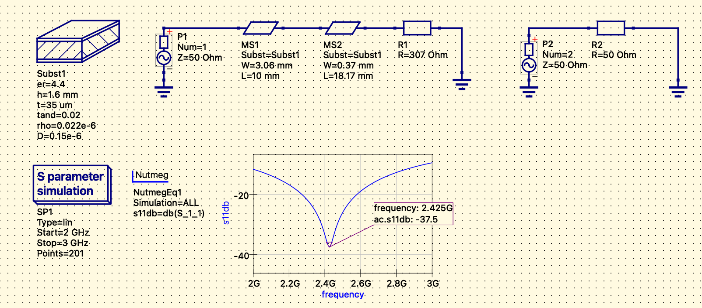

# 2.4 GHz Microstrip Patch Antenna Design

This repository contains the design, calculation, and simulation of a rectangular microstrip patch antenna operating at **2.4 GHz** (ISM Band). The project utilizes a MATLAB script for dimension synthesis based on the Transmission Line Model and a Qucs-S/Ngspice schematic for S-parameter verification.

## Project Structure

The repository is organized as follows:

  - `design.m`: MATLAB script that calculates antenna dimensions (Width, Length) and input impedance based on substrate properties.
  - `simulation.sch`: Qucs-S schematic setup for S-parameter (S11) analysis.
  - `MATLAB_OUTPUT_FIGURE.png`: Visual output of the calculated patch dimensions.
  - `circuit.png`: Schematic diagram and S11 simulation graph.

## Design Specifications

- **Target Frequency:** 2.4 GHz
- **Substrate:** FR4 ($\epsilon_r = 4.4$, $h = 1.6$ mm, $\tan\delta = 0.02$)
- **System Impedance:** $50 \Omega$
- **Feeding Technique:** Microstrip Line Feed (Quarter-Wave Transformer matched)

## Results

### 1. Calculation (MATLAB)
The MATLAB script (`design.m`) calculates the physical dimensions required for resonance:
- **Width (W):** 38.0 mm
- **Length (L):** 29.4 mm
- **Impedance Matching:** Includes calculation for a quarter-wave transformer.

### 2. Simulation (Qucs-S / Ngspice)
The simulation (`simulation/simulation.sch`) results show a clear resonance at approximately **2.425 GHz** with a return loss (S11) of **-37.5 dB**, indicating excellent matching.

## You may ask: Why is there a dummy circuit in the schematic?

In `simulation.sch`, you may notice a secondary, isolated circuit (Port 2 terminated with 50 Ohms) that is not connected to the main antenna.

> **Reason:** This is a workaround for the **Ngspice** engine. In certain configurations, running a single-port S-parameter simulation can trigger an *"RF port not found"* error. Adding a dummy second port forces the solver to recognize the port configuration correctly without affecting the main antenna simulation results.

## Usage

1. **Calculate:** Run `design.m` in MATLAB to verify dimensions or adjust for a different substrate.
2. **Simulate:** Open `simulation.sch` in Qucs-S.
3. **Run:** Ensure Ngspice is selected as the default simulator and run the simulation to view S-parameters.

---
*Created by Ceren Çelik*
